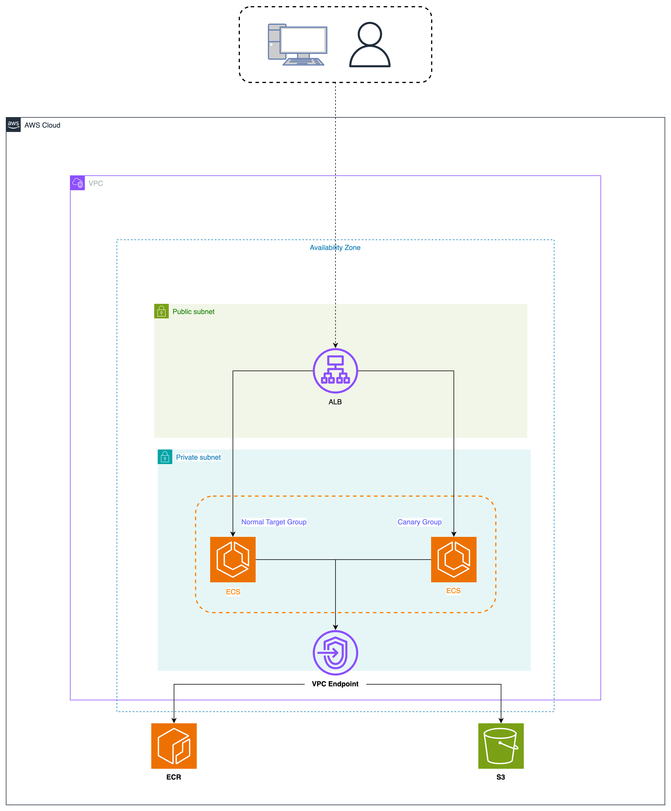

# aws-ecs-canary
# Overview
Repository for Amazon ECS Canary Service.\
blog link: https://zenn.dev/hosimesi/articles/903dcbad6e050b




# How to use
1. Change directory.
    ```bash
    cd path/to/aws_ecs_canary
    ```
2. Run up.
    ```bash
    $ docker compose up --build
    ```
3. Terraform Apply
    ```bash
    $ terraform apply
    ```
4. Docker build
    ```bash
    $ aws ecr get-login-password --region ap-northeast-1 | docker login --username AWS --password-stdin xxxxx.dkr.ecr.ap-northeast-1.amazonaws.com
	$ docker build --platform=linux/amd64 -t http-server/canary -f docker/Dockerfile .
	$ aws ecr get-login-password --region ap-northeast-1 | docker login --username AWS --password-stdin xxxxx.dkr.ecr.ap-northeast-1.amazonaws.com
	$ docker build --platform=linux/amd64 -t http-server/main -f docker/Dockerfile .
    ```
5. Push Image
    ```bash
    $ docker tag http-server/canary:latest xxxxx.dkr.ecr.ap-northeast-1.amazonaws.com/http-server/canary:latest
	$ docker push xxxxx.dkr.ecr.ap-northeast-1.amazonaws.com/http-server/canary:latest
	$ docker tag http-server/main:latest xxxxx.dkr.ecr.ap-northeast-1.amazonaws.com/http-server/main:latest
	$ docker push xxxxx.dkr.ecr.ap-northeast-1.amazonaws.com/http-server/main:latest
    ```
6. Request
    ```bash
    @canary_counter=0 ; \
	main_counter=0 ; \
	for i in $$(seq 1 200) ; do \
		response=$$(curl -s $(ALB_DNS)) ; \
		echo "$$response" | grep -q "app-canary" && canary_counter=$$((canary_counter+1)) ; \
		echo "$$response" | grep -q "app-main" && main_counter=$$((main_counter+1)) ; \
	done ; \
	echo "Canary responses: $$canary_counter" ; \
	echo "Main responses: $$main_counter"
    ```
